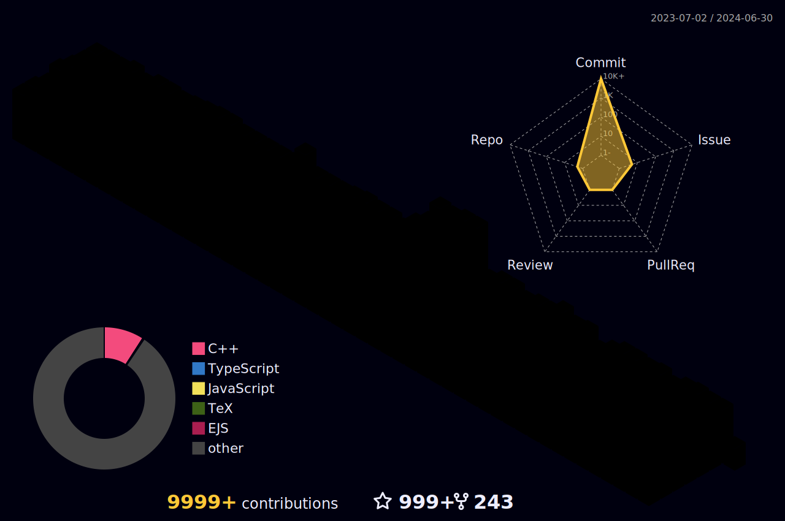

<h1 align="center">
  Hello Folks, My name is Vanshaj Barnwal 
  
</h1>

<h3 align="center">
  A passionate full stack developer and software engineer from India
</h3>

<br>


### Who Am I? 🤠

- 🤓 Self taught Developer
- 👩‍💻 Working on Web & App Development
- 📝 Writing Words, Compiling Code
- 🎯 Goal : To be a better Developer

<br>

**To support my work, follow me here on GitHub, it means a lot🥹**

<br>
<br>

<p align="center">
   •   
  
  <a href="https://user-badge.committers.top/india_private/V4nshaj">
    
  </a> •
  
   •
  
   •
  
  <a href="https://github.com/sponsors/V4nshaj">
    
  </a>
</p>

#


<p align="center">
  
  
  
  
  
</p>

#

<br>

## 𝙻𝙰𝙽𝙶𝚄𝙰𝙶𝙴𝚂 𝙰𝙽𝙳 𝚃𝙾𝙾𝙻𝚂

<br>

<div align="center">

<code></code>

<code></code>

<code></code>

<code></code>

<code></code>

<code></code>

<hr width="400">

<code></code>

<code></code>

<code></code>

<code></code>

<code></code>

<code></code>

</div>

<br>

#

<details open>
<summary>
  📈 <strong>𝙶𝚒𝚝𝚑𝚞𝚋 𝚂𝚝𝚊𝚝𝚜 :</strong>
</summary>

<br>

<p align="center">

  

  

</p>

</details>

<br>


<!--  -->

<div align="center">

```diff
+@ @ @ @ @ @ @ @ @ @ @ @ @ @ @ @ @ @ @ @ @ @ @ @ @ @ @ @+
@@       o o                                           @@
@@       | |                                           @@
@@      _L_L_                                          @@
@@   ❮\/__-__\/❯ Programming isn't about what you know @@
@@   ❮(|~o.o~|)❯  It's about what you can figure out   @@
@@   ❮/ \`-'/ \❯                                       @@
@@     _/`U'\_                                         @@
@@    ( .   . )     .----------------------------.     @@
@@   / /     \ \    | while( ! (succeed=try() ) ) |   @@
@@   \ |  ,  | /    '----------------------------'     @@
@@    \|=====|/                                        @@
@@     |_.^._|                                         @@
@@     | |"| |                                         @@
@@     ( ) ( )   Testing leads to failure              @@
@@     |_| |_|   and failure leads to understanding    @@
@@ _.-' _j L_ '-._                                     @@
@@(___.'     '.___)                                    @@
+@ @ @ @ @ @ @ @ @ @ @ @ @ @ @ @ @ @ @ @ @ @ @ @ @ @ @ @+

</div> <br>

<br>
<br> <!--END_SECTION:waka--> <h1> Connect With Me  </h1> <p align="center"> <a href="https://linkedin.com/in/vanshaj-barnwal" target="blank">  </a> <a href="https://www.leetcode.com/v4nshaj" target="blank">  </a> </p> <br> <div align="center">
𝚂𝚑𝚘𝚠 𝚜𝚘𝚖𝚎 ❤️ 𝚋𝚢 𝚜𝚝𝚊𝚛𝚛𝚒𝚗𝚐 𝚜𝚘𝚖𝚎 𝚘𝚏 𝚝𝚑𝚎 𝚛𝚎𝚙𝚘𝚜𝚒𝚝𝚘𝚛𝚒𝚎𝚜!
</div>
